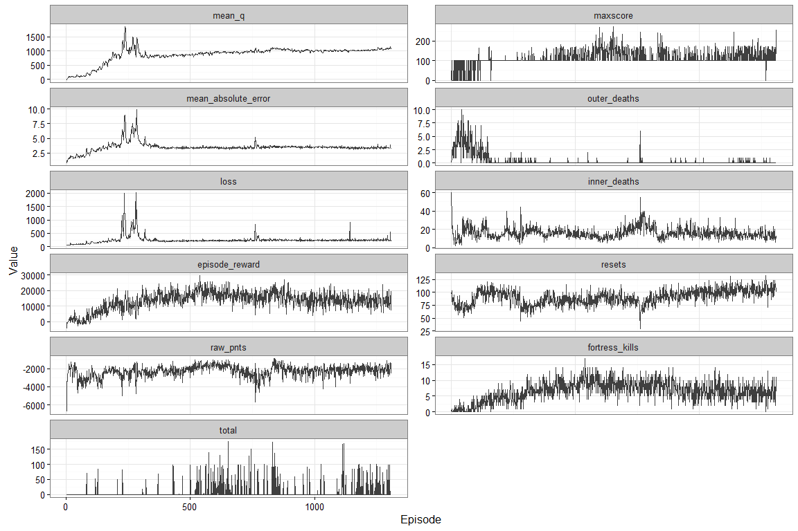
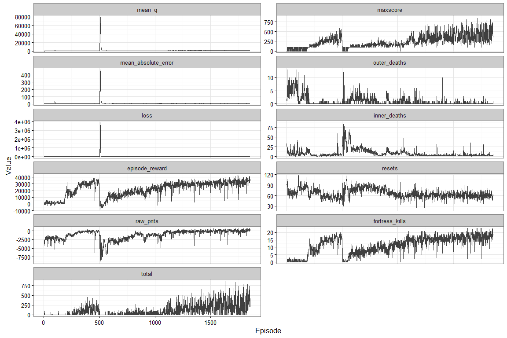

# Deep Learning Spacefortress Models

***

## Autoturn SF Notes

  * STEPS_PER_EPISODE = 5455

## Design

  * Learning Agent (i.e. training algorithm): DQN (Deep Q Network)
    - Replay Buffer Length: STEPS_PER_EPISODE*1000
  * Exploration Policy: EpsilonGreedy
  * Network: 3 layers of 64 fully connected nodes
  * State History Length: 8

## Model Variants

  * Model 1
    - 4 Actions: NOOP, THRUST, SHOOT, THRUST&SHOOT
    - Input 10: ship_alive, ship_orientation, ship_vdir, ship_distance-from-fortress, 
                fortress_alive, vlner, N_missiles, N_shells, isThrusting, isShooting
    
  * Model 2 - 3 Actions
    - NOOP, THRUST, SHOOT, THRUST&SHOOT
    - Input 11: ship_alive, ship_orientation, ship_vdir, ship_distance-from-fortress, 
                fortress_alive, vlner, N_missiles, N_shells, pnts, isThrusting, isShooting

### Model1 Results

What it learns (and doesn't learn):
  * That thrusting increases survivability and thus +reward opportunities
    - i.e. avoids outer hex but doesn't quite learn circular flight, lots of inner crashes
  * That raising the vulnerability above 10 enables big reward from shooting
    - i.e. it learns how to kill the fortress and is hasn't learned the shots timing rules

<!-- -->

### Model2 Results

What it learns (and doesn't learn):
  * Learns to avoid both inner and outer hex
    - i.e. it learns a ciruclar flight plan, can complete multiple orbits without crashing
  * That raising the vulnerability above 10 enables big reward from shooting
    - i.e. it learns how to kill the fortress
  * Might be learning the shots timing rules

<!-- -->

## Thoughts

  * Reward should scale with rarity (i.e. habituation?)
  * Reward magnitude reflects learning priority and timespan
  * Replay buffer filling up is like a warm-up after taking a break
    - Should buffer be filled/pruned intelligently (e.g. local maxima/minima)
  * Inferring the timing/reset rule is hard because it conflicts with the kill rule
  * thrusting = avoiding negative reward, shooting = gaining positive reward
  * predictive eye movements: saccade to border where impact is imminent
