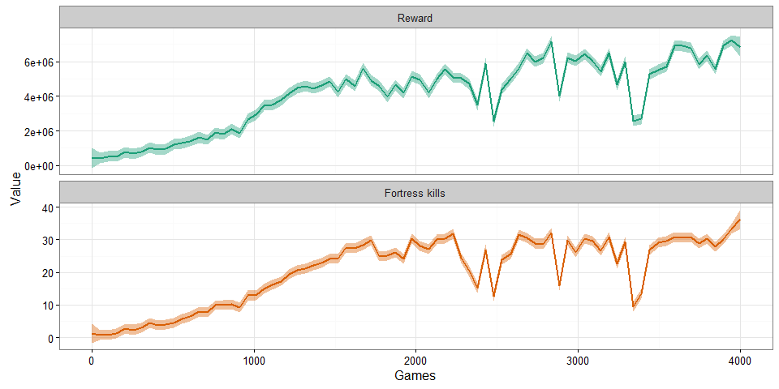
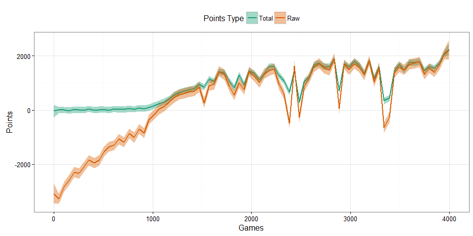
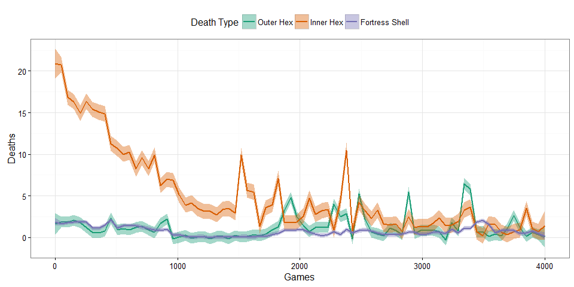
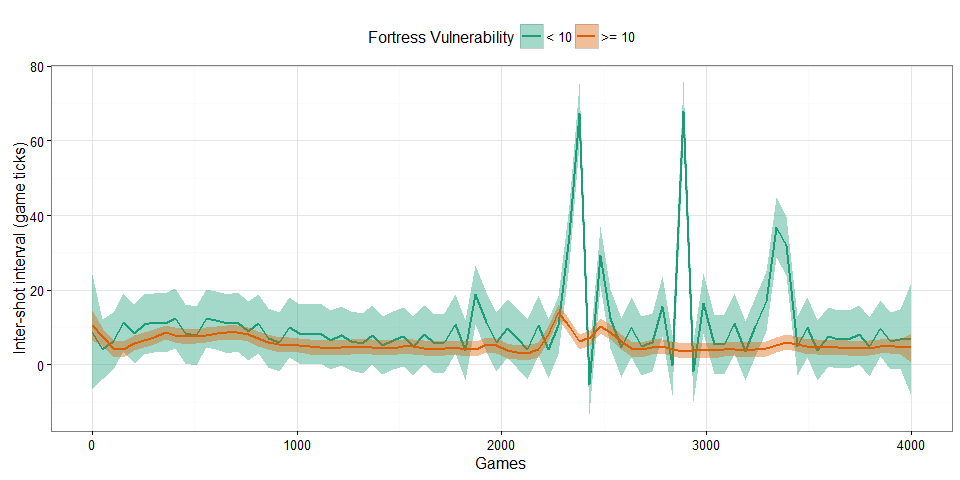
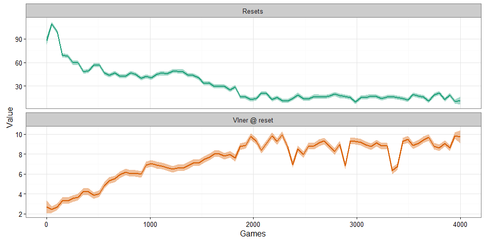

# Playing Space Fortress with Deep RL
Ryan Hope  
  

---

# Deep RL

One of the most successful applications of deep learning to the RL problem is the work by [@Mnih2013], who created a convolutional neural network trained with a variant of Q-learning called a Deep Q-Network (DQN). With the only prior knowledge being the available actions, using the same network architecture and hyperparameters, the DQN model was able to learn to play a wide range of Atari 2600 video games with just raw pixels and a reward signal (i.e. points in game) as input [@Mnih2013; @Mnih2015]. Out of 49 games tested, their model performed better than the best linear learner in nearly all instances, and for 29 games, their model performed as good as or better than professional game players. The games that DQN model excelled at varied greatly in their genres and visual appearance, from side-scrolling shooters (e.g. River Raid) to, sports games (e.g. Boxing) and 3D auto racing games (e.g. Enduro). The authors argue that for certain games the model is able to discover relatively long-term strategies. For example, in the game Breakout, the DQN model is able to learn to dig a tunnel along the wall which allows the ball to be sent around the back to destroy a large number of blocks. Nevertheless, the DQN model struggles with games that require temporally extended rules/strategies and/or higher than first-order control. For example, the DQN model was only able to score 13\% of what a professional player in Ms. Pac-Man, a game that requires continual path planning and obstacle avoidance. Similarly, the DQN model only achieved 7\% of the score of a professional player in Asteroids, a game that requires second-order control (acceleration) of a spaceship in a frictionless environment. Temporally extended strategies and high-order control remain major challenges for all learning agents.

# Space Fortress and RL

The autoturn variant of the game Space Fortress, ASF, is a particularly challenging learning environment. First, like asteroids, SF involves flying a spaceship in a frictionless environment, and thus requires the agent to learn a second-order control policy for the ship in order to avoid the 100 point deductions (i.e. negative reward) that occur from colliding with either of the hexagons or for being destroyed by a fortress shell. Second, scoring points in SF requires the agent to learn a number temporally extended rules. For example, the only way to score points in SF is to destroy the fortress (100 points), which can only happen when the fortress is vulnerable. Making the fortress vulnerable to destruction involves landing 10 shots on the fortress in a row (temporally extended rule 1) without exceeding a hit rate of 4 per second (temporally extended rule 2) else the vulnerability count is reset to 0. Once the fortress is vulnerable it can be destroyed by shooting at a rate faster than 4 shots per second (temporally extended rule 3). Additionally, in order to penalize vulnerability resets, 2 points are deducted for every shot taken, which over time will penalize agents that trigger lots of vulnerability resets. However, since the score displayed is restricted to a minimum of 0 (in an attempt to keep morale high for humans during the initial learning stage), the total points value provides a very poor reward signal for a synthetic reinforcement learning agents since no feedback would be given until the first fortress kill and the synthetic agent is native to all rules. The unresitricted (raw) points is a better signal to use since the negative reward from deaths helps the agent learn to flight controls. Unfortunately, nothing in the raw points score reflects achiving the very important subgoal state of making the fortress vulnerable.

## Modified score (reward signal)

Rewards and penalties spread over orders of magnitude to prioritize fortress kills. The following reward signal in general reflects all of the game rules a human learning agent would start with.

**Rewards:**

+ Fortress kill: +100000
+ Vulnerability increase: +vlner^2
+ Every step: +0.5 * steps since last death

**Penalties:**

+ Vulnerability resets: -vlner
+ Shell deaths: -100
+ Hexagon deaths: -1000

# Model Design

+ **Training Algorithm:** Double DQN
    - **Sequential memory:** 400 games
    - **Frameskip:** 2
    - **Window length:** 4
+ **Network:** Multilayer Perceptron
    - **Input:** Mix of 15 raw and hand crafted features
    - **Hidden:** 3 layers of 64 fully connected nodes
    - **Output:** 3 actions (no-op, shoot, thrust)
+ **Exploration Policy:** Linearlly Annealed Epsilon Greedy
    - Epsilon decreased from .4 to .01 over first 2000 games
+ **Optimizer:** Adam
    - **Learning rate:** .00025
    
# Model Input

**State Vector:**

+ Ship alive
+ Ship horizontal position
+ Ship vertical position
+ Ship horizontal velocity
+ Ship vertical velocity
+ Ship orientation
+ Ship vdir (custom feature)
+ Ship distance from fortress
+ Fortress alive
+ Number of missiles on screen
+ Number of shells on screen
+ Fortress vulnerability
+ Points
+ Ticks since last thrust
+ Ticks since last shot

# Model Performance

## Reward and fortress kills

<!-- -->

## Points

<!-- -->

## Death types

<!-- -->

## Inter-shot intervals

<!-- -->

## Vulnerability resets

<!-- -->

# References
